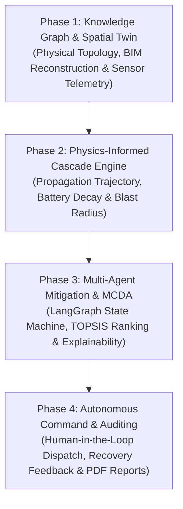

# ResilienceOS 🏥

### Autonomous Hospital Infrastructure Digital Twin & Clinical Resilience Decision Support System

[](https://fastapi.tiangolo.com)
[](https://reactjs.org/)
[](https://threejs.org/)
[](https://vercel.com)
[](https://render.com)
[](https://networkx.org/)
[](tests/)
[](docker-compose.yml)
[](LICENSE)

**ResilienceOS** is an enterprise-grade digital twin platform engineered to safeguard critical acute healthcare environments (Intensive Care Units, Operating Theatres, Emergency Trauma, Cleanrooms). By combining **directed property knowledge graphs**, **physics-informed failure propagation engines**, **multi-criteria decision analysis (MCDA / TOPSIS)**, and **real-time 3D spatial WebGL rendering**, ResilienceOS predicts systemic vulnerabilities, simulates multi-system cascade disruptions, and prescribes prioritized mitigation strategies to ensure zero disruption to life-support care.

---

## 🚨 The Core Problem Statement & What is a Digital Twin?

### 1. The Real-World Problem in Plain English
Hospitals are not just buildings—they are fragile, multi-utility life-support machines:
* **Power Grid** feeds $\to$ **Transformers** $\to$ **HVAC Chillers** $\to$ **Operating Theatres & Cleanroom Pressure**.
* **Electrical Bus** $\to$ **UPS Batteries** $\to$ **ICU Ventilators & Dialysis**.
* **Liquid Oxygen Bulk Storage** $\to$ **Atmospheric Vaporizers** $\to$ **Mechanical Ventilator Gas Pendants**.

When a primary transformer fails or an oxygen line drops pressure, it **cascades across separate utilities**. Within 8 to 15 minutes:
1. Chillers stall $\to$ ICU & surgical rooms experience thermal runaway.
2. UPS batteries discharge rapidly $\to$ Ventilators and surgical monitors lose power.
3. **Traditional BMS alarms only ring AFTER equipment fails.** Operators panic, drown in 50+ uncoordinated alerts, and cannot mathematically compute multi-variable recovery trade-offs under extreme pressure.

### 2. What is our "Digital Twin"? (It's NOT just a 3D model!)
A **3D model** is static. A **Digital Twin** is a living, state-synchronized computational replica:
* **Physical Asset State:** Real-time telemetry (kW load, temperature, barometric pressure, battery SOC).
* **Graph Topology ($G = \mathcal{V}, \mathcal{E}$):** 52 infrastructure nodes connected by physical dependencies (`POWERS`, `COOLS`, `PROVIDES_GAS`, `BACKS_UP`).
* **Predictive Physics:** When node $A$ trips, the twin computes the cascade path to node $B$ across time ($T+0 \to T+45\text{min}$) before the physical equipment actually breaks.

---

## 🗺️ Project Implementation Phases



| Phase | Title | Core Objective | Key Deliverables & Tech Stack |
|---|---|---|---|
| **Phase 1** | **Spatial Digital Twin & Topology Graph** | Model the physical hospital campus and establish multi-utility dependency graphs. | • BIM-grade 5-floor 3D WebGL reconstruction (Three.js / React Three Fiber)<br/>• Directed Property Knowledge Graph (NetworkX, 52 Nodes, 112 Edges)<br/>• Real-time OPC-UA / MQTT telemetry ingestion schemas |
| **Phase 2** | **Temporal Cascade Failure Engine** | Simulate multi-hop failure propagation trajectories before alarms fire. | • Discrete time-step simulation engine ($T+0 \to T+45\text{min}$)<br/>• Physics-based UPS battery discharge & generator spool dynamics<br/>• Dynamic Resilience Index ($R \in [0, 100]$) synthesis |
| **Phase 3** | **Multi-Agent Mitigation & Decision Lab** | Generate and rank optimal recovery strategies under multi-variable constraints. | • Multi-Agent LangGraph workflow with strict Pydantic verification<br/>• TOPSIS / MCDA multi-criteria strategy ranking (Strategies A–F)<br/>• Causal Explainable AI (XAI) natural language reasoning engine |
| **Phase 4** | **Human-in-the-Loop Execution & Compliance** | Provide 1-click execution dispatch and automated regulatory incident audits. | • Human-in-the-Loop safety approval gateway with state rollback<br/>• Live self-healing feedback loop with real-time twin synchronization<br/>• Executive post-mortem PDF compliance report studio |

---

## 📑 Table of Contents

1. [The Core Problem Statement & What is a Digital Twin?](#-the-core-problem-statement--what-is-a-digital-twin)
2. [Project Implementation Phases](#️-project-implementation-phases)
3. [Core Platform Capabilities](#-core-platform-capabilities)
4. [System Architecture & Data Flow](#-system-architecture--data-flow)
5. [Mathematical & Algorithmic Formulations](#-mathematical--algorithmic-formulations)
6. [8-View Command Center Interface](#-8-view-command-center-interface)
7. [Installation & Deployment Guide](#-installation--deployment-guide)

* 🌐 **BIM-Grade 3D Digital Twin:** Spatial WebGL campus reconstruction (React Three Fiber) rendering 5 architectural floor levels (Basement B1, Ground L1, Floor 2, Floor 3, Roof L4), clinical room polygons, interactive 3D equipment assets, dynamic heatmaps, volumetric status glow shaders, and orthogonal Manhattan utility pipelines (color-coded for Power, MedGas, HVAC, Water) with dual Daylight Cleanroom / Dark Command Center lighting.
* 🔗 **Graph Knowledge Engine:** Directed property graph ($G = (\mathcal{V}, \mathcal{E})$) modeling 52 physical nodes and 112 multi-tier dependency edges with relationship taxonomies (`POWERS`, `BACKS_UP`, `SUPPLIES`, `COOLS`, `PROVIDES_WATER`, `PROVIDES_GAS`).
* ⏱️ **Temporal Cascade Simulator:** Simulates discrete multi-hop failure propagation across $T+0 \to T+45$ minute horizons with physics-based battery decay curves, diesel generator startup delays, and cryogenic boil-off dynamics.
* 📊 **Multi-Criteria Resilience Synthesis ($0-100$):** Real-time composite metric aggregating Service Continuity ($S_c$), Backup Redundancy ($R_b$), Dynamic Adaptability ($A_p$), and Recovery Latency ($L_r$).
* ⚖️ **TOPSIS Strategy Lab:** Evaluates and ranks 6 operational response strategies (**Strategies A through F**) against multi-criteria trade-offs (ICU continuity, time-to-impact, operational cost, grid dependency).
* 🧠 **Explainable AI (XAI) Causal Engine:** Generates natural-language reasoning chains directly extracted from graph traversal paths (*"Why is ICU at risk? Because Primary Transformer T1 tripped $\to$ Main Bus dropped $\to$ UPS discharging at 1.8x load"*).
* 📑 **Autonomous Document Studio & Reports:** Produces formal executive incident reports, compliance logs, and data exports in PDF, Excel, PowerPoint, and JSON formats with live WYSIWYG paper-sheet previews and print-isolated stylesheets.
* 🌓 **Adaptive Dual Theme:** Futuristic Dark Command Center interface and Light Medical Cleanroom visual mode across all 8 operational views.

---

## 🏗️ System Architecture & Data Flow

```
┌───────────────────────────────────────────────────────────────────────────────────┐
│                           RESILIENCE OS FRONTEND CLIENT                           │
│  React 19 • Vite • React Three Fiber 3D Canvas • Glassmorphism Telemetry HUD      │
│  8 Views: Dashboard | Digital Twin | Start Sim | What-If | Timeline | Risk | Rep │
└────────────────────────────────────────┬──────────────────────────────────────────┘
                                         │ REST APIs & WebSocket (1s Sync)
                                         ▼
┌───────────────────────────────────────────────────────────────────────────────────┐
│                             FASTAPI BACKEND RUNTIME                               │
│  • Singleton Digital Twin State Service    • FastAPI REST Router & Endpoints     │
│  • Real-Time Broadcast WebSocket Manager   • Pydantic V2 Domain Schemas           │
└──────┬─────────────────┬───────────────────┬───────────────────┬──────────────────┘
       │                 │                   │                   │
       ▼                 ▼                   ▼                   ▼
┌──────────────┐  ┌──────────────┐    ┌──────────────┐    ┌─────────────────────────┐
│ KNOWLEDGE    │  │ CASCADE      │    │ RESILIENCE   │    │ STRATEGY & DECISION     │
│ GRAPH ENGINE │  │ PROPAGATION  │    │ SYNTHESIS    │    │ LAB (MCDA / TOPSIS)     │
│ NetworkX     │  │ Physics &    │    │ Bounded      │    │ Strategies A–F Ranking, │
│ 52 Nodes     │  │ Graph BFS    │    │ Formulation  │    │ Causal Path Reasoning   │
│ 112 Edges    │  │ T+0 → T+45m  │    │ R ∈ [0, 100] │    │ (Explainable AI Engine) │
└──────────────┘  └──────────────┘    └──────────────┘    └─────────────────────────┘
```

---

## 📐 Mathematical & Algorithmic Formulations

### 1. Directed Property Dependency Graph
The hospital infrastructure topology is modeled as a directed multi-edge property graph:

$$\mathcal{G} = (\mathcal{V}, \mathcal{E}, \Phi, \Psi)$$

Where:
* $\mathcal{V} = \mathcal{V}_{\text{infra}} \cup \mathcal{V}_{\text{service}}$ is the set of 52 physical nodes (generators, transformers, pumps, chillers, buses) and 8 critical clinical services.
* $\mathcal{E} \subseteq \mathcal{V} \times \mathcal{V}$ is the set of 112 directed dependency edges.
* $\Phi: \mathcal{V} \to \{\text{Power}, \text{Water}, \text{HVAC}, \text{Gas}, \text{Clinical}\}$ partitions nodes into functional subsystems.
* $\Psi: \mathcal{E} \to \{\text{POWERS}, \text{BACKS\_UP}, \text{SUPPLIES}, \text{COOLS}, \text{PROVIDES\_WATER}, \text{PROVIDES\_GAS}\}$ classifies dependency relationships.

---

### 2. Resilience Index Synthesis ($R$)
The composite Resilience Index $R \in [0, 100]$ evaluates holistic hospital operational integrity as a weighted linear combination of four normalized sub-criteria:

$$R = 100 \times \left( w_s S_c + w_b R_b + w_a A_p + w_l L_r \right)$$

| Component | Metric | Weight ($w_i$) | Formulation |
| :--- | :--- | :--- | :--- |
| **Service Continuity ($S_c$)** | Healthcare delivery across critical units | $w_s = 0.40$ | $S_c = \frac{\sum_{i \in \text{Services}} \omega_i \cdot \text{delivery\_pct}_i}{\sum \omega_i}$ |
| **Backup Redundancy ($R_b$)** | Available standby capacity margin | $w_b = 0.25$ | $R_b = \frac{1}{|\mathcal{A}_{\text{backup}}|} \sum_{j} \frac{C_{\text{avail}, j}}{C_{\text{rated}, j}}$ |
| **Dynamic Adaptability ($A_p$)** | Rerouting & cross-tie switching headroom | $w_a = 0.20$ | $A_p = \frac{\text{Operational Paths}}{\text{Total Dependency Paths}}$ |
| **Latency / Health ($L_r$)** | Equipment health & thermal degradation | $w_l = 0.15$ | $L_r = \frac{1}{|\mathcal{V}_{\text{infra}}|} \sum_{k} \frac{H_k}{100}$ |

*Constraint:* $\sum w_i = 0.40 + 0.25 + 0.20 + 0.15 = 1.00$.

---

### 3. Physics-Informed Cascade Propagation

#### A. Static UPS Battery Depletion
Under emergency inverter discharge, UPS battery runtime follows Peukert-adjusted energy discharge:

$$E(t) = E_0 - \int_{0}^{t} \frac{P_{\text{load}}(\tau)}{\eta_{\text{inverter}}} d\tau, \quad \text{SOC}(t) = \frac{E(t)}{E_{\text{rated}}} \times 100\%$$

When $\text{SOC}(t) \le 20\%$, automatic load-shedding is triggered; at $\text{SOC}(t) = 0\%$, all connected critical branch circuits fail.

#### B. Standby Diesel Generator Thermal Spooling
Standby generators require warmup delay $\tau_{\text{warm}}$ (default 10s ATS fast-crank) before assuming full rated load:

$$P_{\text{gen}}(t) = \begin{cases} 0 & t < t_{\text{start}} \\ P_{\text{rated}} \cdot \left(\frac{t - t_{\text{start}}}{\tau_{\text{warm}}}\right) & t_{\text{start}} \le t < t_{\text{start}} + \tau_{\text{warm}} \\ P_{\text{rated}} & t \ge t_{\text{start}} + \tau_{\text{warm}} \end{cases}$$

---

### 4. TOPSIS Multi-Criteria Decision Ranking
To evaluate mitigation strategies (**Strategies A through F**), the platform utilizes the Technique for Order of Preference by Similarity to Ideal Solution (TOPSIS):

1. **Normalized Decision Matrix ($r_{ij}$):**
   $$r_{ij} = \frac{x_{ij}}{\sqrt{\sum_{k=1}^{m} x_{kj}^2}}$$
2. **Weighted Normalized Matrix ($v_{ij}$):**
   $$v_{ij} = w_j \cdot r_{ij}$$
3. **Ideal ($A^+$) and Negative-Ideal ($A^-$) Solutions:**
   $$A^+ = \{ \max_i v_{ij} \mid j \in J_{\text{benefit}} \}, \quad A^- = \{ \min_i v_{ij} \mid j \in J_{\text{benefit}} \}$$
4. **Euclidean Distances & Relative Closeness ($C_i^*$):**
   $$D_i^+ = \sqrt{\sum_j (v_{ij} - v_j^+)^2}, \quad D_i^- = \sqrt{\sum_j (v_{ij} - v_j^-)^2}$$
   $$C_i^* = \frac{D_i^-}{D_i^+ + D_i^-}, \quad C_i^* \in [0, 1]$$

---

## 🖥️ 8-View Command Center Interface

The platform provides 8 specialized operational views matching medical command center workflows:

1. 📊 **Dashboard (Executive Overview):** Real-time campus telemetry strip, 4 core KPI cards, interactive 3D campus overlay pins, and live incident log.
2. 🌐 **Digital Twin (3D Spatial BIM):** Full 3D interactive viewport with layer isolation, floor level slicing (B1 to L4), room polygon focus, orthogonal utility pipelines (Power, MedGas, HVAC, Water), and individual asset telemetry inspection.
3. ⚡ **Start Simulation (Failure Injection):** Scenario selector (Electrical Grid Outage, Transformer Trip, O2 Rupture, Chiller Trip, Combined Disaster), severity & duration controls, and real-time 3D twin reaction canvas.
4. 🔬 **What-If Analysis (Decision Lab):** Side-by-side comparison of Strategies A through F with TOPSIS scores, trade-off radar charts, and execution levers.
5. ⏱️ **Incident Timeline (Cascade Stepper):** Milestone-based temporal scrubber ($T+0, T+5, T+10, T+20, T+45$ min) showing subsystem failure propagation and explainability drawer.
6. 🛡️ **Risk & Resilience (Vulnerability Analytics):** 6 KPI summary pills, 5 circular SVG factor dials, ranked single-point-of-failure (SPOF) table, and clinical care continuity bars.
7. 📑 **Reports (Executive Document Studio):** Incident report generator with PDF, Excel, PowerPoint, and JSON export options and formatted live paper sheet preview.
8. ⚙️ **Settings (Model & Rules Configuration):** Hospital topology profiles, simulation speed multipliers, safety threshold rules, 3D options, and Dark/Light theme toggles.

---

## 📁 Repository & Directory Structure

```
Resilience OS/
├── backend/                        # FastAPI Backend Application
│   ├── app/
│   │   ├── api/                    # REST API Endpoints & Routers
│   │   ├── core/                   # Security, Config & Lifecycle
│   │   ├── services/               # State Coordinator & WebSocket Manager
│   │   └── main.py                 # FastAPI App Entrypoint
│   └── Dockerfile                  # Production Backend Container
├── simulation/                     # Physics & Cascade Engine
│   ├── state_engine.py             # Asset & Service State Machine
│   ├── cascade_engine.py           # Breadth-First Multi-Hop Cascade
│   ├── resilience_index.py         # 4-Pillar Resilience Formulator
│   ├── what_if_engine.py           # Strategies A–F & TOPSIS Ranking
│   ├── risk_engine.py              # SPOF & Vulnerability Scoring
│   ├── report_generator.py         # Autonomous Document Formatter
│   └── explanation_engine.py       # Causal Graph Traversal Reasoner
├── graph/                          # Dependency Knowledge Graph
│   ├── schema.py                   # Node & Edge Type Definitions
│   ├── topology_builder.py         # 52-Node Hospital Graph Generator
│   └── traversals.py               # Blast Radius & Centrality Metrics
├── models/                         # Shared Pydantic Schemas & Domain Types
├── scenarios/                      # JSON Scenario Fixtures
├── docs/                           # Technical Specifications
│   ├── simulation-methodology.md   # Mathematical Formulas & Decay Curves
│   ├── graph-topology-specification.md # Graph Schema & Node Registry
│   ├── evaluation-mcda-ranking.md  # TOPSIS & MCDA Decision Formulations
│   └── api-reference.md            # Complete API Documentation
├── frontend/                       # React 19 + Three.js Command Center
│   ├── src/
│   │   ├── components/
│   │   │   ├── DigitalTwin3D/      # 3D BIM Canvas, Rooms, Floors, Pipelines & Shaders
│   │   │   ├── IncidentControl/    # Failure Injection & Cascade Stepper
│   │   │   ├── ResilienceGauge/    # SVG Circular Resilience Dial
│   │   │   ├── StrategyLab/        # Strategy Comparison & TOPSIS Matrix
│   │   │   ├── RiskResilience/     # Risk Dials & SPOF Ranking Table
│   │   │   ├── Reports/            # Document Studio & Live Paper Preview
│   │   │   ├── Settings/           # Topology & Safety Rules Config
│   │   │   ├── StartSimulation/    # Failure Scenario Launchpad
│   │   │   └── Home/               # Interactive Campus Hero & Telemetry
│   │   ├── mock/                   # Deterministic Benchmark State Data
│   │   └── App.jsx                 # 8-View Coordinator
│   ├── Dockerfile                  # Production Frontend Nginx Container
│   └── nginx.conf                  # Reverse Proxy Configuration
├── tests/                          # 106 Unit & Integration Tests (100% Passing)
├── docker-compose.yml              # Multi-Container Orchestration
├── start.bat                       # One-Click Windows Development Runner
└── requirements.txt                # Python Backend Dependencies
```

---

## 📡 REST & WebSocket API Reference

The backend provides OpenAPI 3.0 documentation at `/docs`.

| Method | Endpoint | Description |
| :--- | :--- | :--- |
| `GET` | `/api/hospital/state` | Retrieves live digital twin state, Resilience Index, and sensor telemetry. |
| `GET` | `/api/assets` | Returns catalog of all 52 infrastructure assets with health and load metrics. |
| `GET` | `/api/services` | Returns status of all 8 critical care units with delivery percentage. |
| `POST` | `/api/failures/inject` | Injects equipment failure (e.g. `GRID_MAIN`, `TRANSFORMER_01`). |
| `GET` | `/api/simulation/what-if` | Runs What-If simulation comparing Strategies A through F with TOPSIS scores. |
| `POST` | `/api/simulation/apply-strategy` | Applies intervention strategy and updates digital twin state. |
| `GET` | `/api/dependencies` | Returns complete dependency knowledge graph (nodes + edge attributes). |
| `GET` | `/api/graph/bottlenecks` | Computes betweenness centrality and single-point-of-failure vulnerabilities. |
| `GET` | `/api/explanations/{service_id}` | Returns natural-language causal dependency explanation for service risk. |
| `GET` | `/api/reports/generate` | Generates structured incident analysis and compliance summary report. |
| `POST` | `/api/hospital/reset` | Resets digital twin to 100% nominal baseline state. |
| `WS` | `/ws/telemetry` | WebSocket stream broadcasting real-time state frames every 1.0 second. |

---

## 🚀 Installation & Deployment Guide

### Prerequisites
* **Python 3.10+** (Python 3.11 / 3.12 / 3.13 / 3.14 fully supported)
* **Node.js 18+** & `npm`
* **Docker & Docker Compose** *(Optional, for containerized deployment)*

---

### ☁️ Cloud Deployment (Vercel + Render)

ResilienceOS can be deployed to the cloud for free with zero-configuration serverless hosting:

```
┌─────────────────────────────────────────┐       WebSocket (WSS) / REST API       ┌─────────────────────────────────────────┐
│          VERCEL (React 19 Frontend)     │ ─────────────────────────────────────► │       RENDER (FastAPI Backend + DB)     │
│   • 3D WebGL Digital Twin HUD           │ ◄───────────────────────────────────── │   • Singleton State Coordinator         │
│   • Multi-Criteria Decision Studio      │       Real-Time Telemetry Stream       │   • Cascade Engine & Graph BFS          │
└─────────────────────────────────────────┘                                        └─────────────────────────────────────────┘
```

#### 1. Deploy Backend on [Render](https://render.com)
1. In Render Dashboard, click **New +** → **Web Service** and connect your GitHub repository.
2. Configure settings:
   * **Root Directory**: *(Leave blank)*
   * **Runtime**: `Python 3`
   * **Build Command**: `pip install -r requirements.txt`
   * **Start Command**: `uvicorn backend.app.main:app --host 0.0.0.0 --port $PORT`
3. Add Environment Variables under **Advanced**:
   * `PYTHONPATH` = `.`
   * `ENVIRONMENT` = `production`
   * *(Optional)* `DATABASE_URL` = `postgresql+asyncpg://...` (Or omit to use resilient in-memory graph models)
4. Click **Create Web Service**. Render provides your live backend URL (e.g. `https://resilienceos-backend.onrender.com`).

> [!TIP]
> **Free Tier 24/7 Keep-Alive:** Render free tier spins down after 15 min of inactivity. Use a free monitoring service like [cron-job.org](https://cron-job.org/) or [UptimeRobot](https://uptimerobot.com/) to ping `https://<your-render-url>/` every 5–10 minutes to keep your backend warm with 0ms cold starts.

#### 2. Deploy Frontend on [Vercel](https://vercel.com)
1. In Vercel Dashboard, click **Add New...** → **Project** and import your repository.
2. Set configuration:
   * **Framework Preset**: `Vite`
   * **Root Directory**: `frontend`
   * **Build Command**: `npm run build`
   * **Output Directory**: `dist`
3. Add Environment Variable:
   * `VITE_API_BASE_URL` = `https://<your-render-backend-url>.onrender.com`
4. Click **Deploy**. Vercel will build and launch your production command center.

---

### Local Development Setup

#### 1. Clone Repository & Install Backend
```bash
# Clone the repository
git clone https://github.com/CodeVibewithhumza/RESILIENCE-OS.git
cd RESILIENCE-OS

# Install Python backend dependencies
pip install -r requirements.txt
```

#### 2. Install Frontend Dependencies
```bash
cd frontend
npm install
cd ..
```

#### 3. Run Backend & Frontend Servers
In Terminal 1 (Backend):
```bash
python scripts/run_backend.py
```
*Backend API available at: `http://127.0.0.1:8000` | Swagger UI at: `http://127.0.0.1:8000/docs`*

In Terminal 2 (Frontend):
```bash
cd frontend
npm run dev
```
*Frontend Command Center available at: `http://localhost:5173`*

---

### One-Click Windows Launcher
On Windows, simply double-click **`start.bat`** in the root directory. It automatically verifies dependencies, starts the FastAPI backend, launches the Vite dev server, and opens the command center.

---

### Docker & Containerized Deployment
Run the complete stack inside isolated production containers using Docker Compose:

```bash
docker compose up --build -d
```

* Frontend Command Center: `http://localhost:80` (or `http://localhost:5173`)
* Backend REST API: `http://localhost:8000`
* Stop services: `docker compose down`

---

### Running Automated Verification Tests
Run the comprehensive test suite (106 unit and integration tests covering cascade propagation, graph traversal, TOPSIS ranking, resilience formulation, report generation, and REST/WebSocket APIs):

```bash
pytest -v
```

---

## 🛡️ Human-in-the-Loop Safety Protocol

ResilienceOS is engineered as an **AI-Assisted Decision Support System (DSS)** designed for hospital emergency operations centers (EOC) and facility engineers:

1. **Advisory Role:** All strategy rankings and load-shedding actions are advisory. The system does not directly trigger physical switchgear without human operator confirmation.
2. **Transparent Reasoning:** Every risk score and strategy rank is backed by deterministic graph traversal paths accessible via the Explainability Drawer.
3. **Safety Fallbacks:** Hard-coded safety interlocks prevent emergency generator shedding while ICU life-support circuits remain active.

---

## 📄 License

This project is licensed under the **MIT License** — see the [LICENSE](LICENSE) file for details.

---

<div align="center">
  <sub>ResilienceOS • Hospital Infrastructure Digital Twin & Clinical Resilience Decision Support System</sub>
</div>
