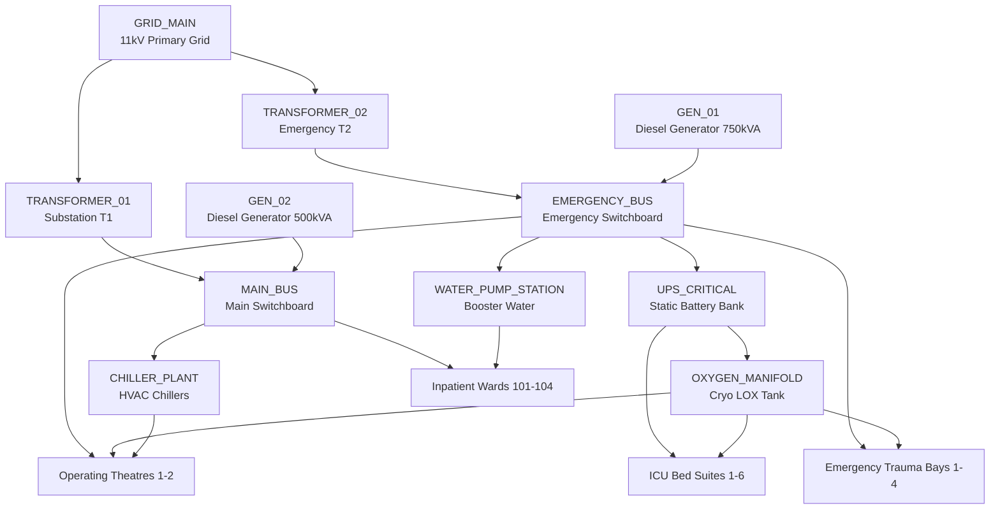

# 🌐 ResilienceOS — Graph Topology & Knowledge Model Specification

## 1. Overview
The **ResilienceOS Dependency Knowledge Graph** models the interconnected utility infrastructure and clinical care services of the hospital as a heterogeneous, directed property graph $G = (\mathcal{V}, \mathcal{E})$.

It formally captures:
* **Infrastructure Nodes ($\mathcal{V}_{\text{infra}}$)**: High-voltage grid, transformers, switchgear, generators, UPS, oxygen manifolds, chillers, water pumps.
* **Clinical Asset Nodes ($\mathcal{V}_{\text{clinical}}$)**: ICU beds, operating theatre suites, emergency trauma bays, inpatient ward rooms.
* **Clinical Service Nodes ($\mathcal{V}_{\text{service}}$)**: ICU Life Support, Surgical Delivery, Emergency Trauma, Inpatient Wards, Administration Operations.
* **Multi-Modal Dependency Edges ($\mathcal{E}$)**: Explicit multi-system links representing power, medical gas, HVAC chilled water, potable water, and telemetry connections.

---

## 2. Node Schema & Properties

### 2.1 Node Attributes
| Attribute | Type | Description |
|---|---|---|
| `id` | `String` | Unique canonical identifier (e.g., `ICU_BED_01`, `GRID_MAIN`, `GEN_01`) |
| `name` | `String` | Human-readable system nomenclature |
| `type` | `String` | Categorical asset type (`substation`, `transformer`, `icu_bed`, etc.) |
| `floor` | `Integer` | Physical floor elevation level ($0 = \text{Plant Yard}, 1 = \text{ED}, 2 = \text{OT}, 3 = \text{ICU}$) |
| `nominal_capacity` | `Float` | Maximum rated continuous output capacity |
| `current_load` | `Float` | Real-time continuous output load demand |
| `capacity_unit` | `String` | Engineering unit of measure (`kVA`, `kW`, `L/min`, `PSI`, `TR`) |
| `criticality_tier` | `Integer` | Tier $1$ (Essential Life Support) to Tier $4$ (Non-Critical Facility) |
| `redundancy_level` | `Integer` | $N+1$, $2N$, or Single-Point-of-Failure indicator |

---

## 3. Edge Types & Dependency Classifications

| Relationship Edge | Source Node | Target Node | Failure Transfer Weight ($w$) |
|---|---|---|:---:|
| `FEEDS_HIGH_VOLTAGE` | `GRID_MAIN` | `TRANSFORMER_01`, `TRANSFORMER_02` | $1.0$ |
| `FEEDS_PRIMARY_POWER` | `TRANSFORMER_01` | `MAIN_BUS` | $1.0$ |
| `FEEDS_ESSENTIAL_POWER`| `TRANSFORMER_02` | `EMERGENCY_BUS` | $0.9$ |
| `STANDBY_BACKUP` | `GEN_01` | `EMERGENCY_BUS` | $0.95$ |
| `STANDBY_BACKUP` | `GEN_02` | `MAIN_BUS` | $0.85$ |
| `INVERTER_SUPPLY` | `EMERGENCY_BUS`| `UPS_CRITICAL` | $1.0$ |
| `LIFE_SUPPORT_POWER` | `UPS_CRITICAL` | `ICU_BED_01` to `ICU_BED_06` | $1.0$ |
| `SURGICAL_POWER` | `EMERGENCY_BUS`| `OT_SUITE_01`, `OT_SUITE_02` | $1.0$ |
| `MEDICAL_OXYGEN_SUPPLY`| `OXYGEN_MANIFOLD`| `ICU_BED_01` to `06`, `OT_01` to `02`, `ED_01` to `04` | $1.0$ |
| `CLEANROOM_COOLING` | `CHILLER_PLANT` | `OT_SUITE_01`, `OT_SUITE_02` | $0.8$ |
| `POTABLE_WATER_SUPPLY` | `WATER_PUMP_STATION`| `WARD_ROOM_101` to `104`, `MAIN_HOSPITAL` | $0.7$ |

---

## 4. Single-Point-of-Failure (SPOF) & Vulnerability Analysis

The graph engine performs topological centralities to identify structural vulnerabilities:
1. **Betweenness Centrality**:
   $$C_B(v) = \sum_{s \ne v \ne t} \frac{\sigma_{st}(v)}{\sigma_{st}}$$
   Nodes with highest betweenness centrality (`EMERGENCY_BUS`, `UPS_CRITICAL`, `OXYGEN_MANIFOLD`) represent single points of critical cascade propagation.
2. **Blast Radius Index**:
   $$\text{BlastRadius}(v) = \frac{|\text{ReachableNodes}(v)|}{|\mathcal{V}|}$$
   A failure at `GRID_MAIN` has a potential blast radius of $100\%$ of all hospital subsystems without automatic generator transfer.
