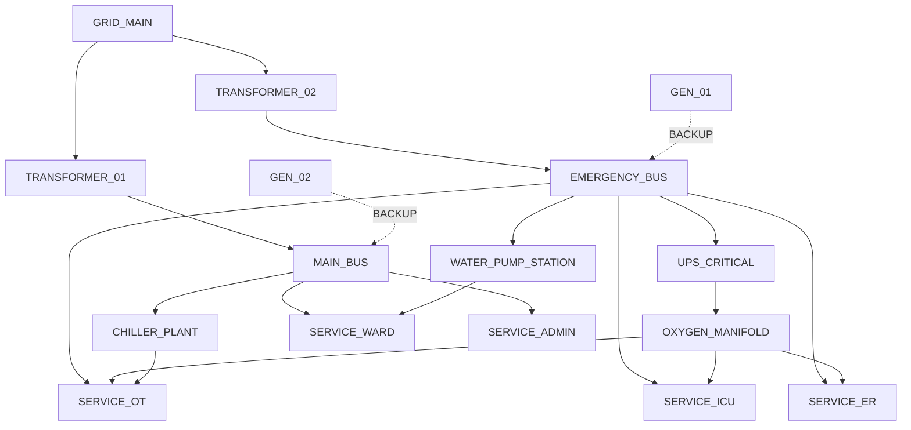

# 🌐 ResilienceOS — Graph Topology & Knowledge Model Specification

## 1. Overview

The **ResilienceOS Dependency Knowledge Graph** models the interconnected infrastructure assets and hospital services of the prototype hospital as a heterogeneous, directed property graph:

\[
G = (\mathcal{V}, \mathcal{E})
\]

It formally captures:

- **Infrastructure Nodes**: Grid, transformers, electrical buses, generators, UPS, HVAC, medical gas, and water infrastructure.
- **Hospital Service Nodes**: ICU, Operating Theatre, Emergency Department, General Ward, and Administration.
- **Typed Dependency Edges**: Explicit directed relationships representing power, backup, cooling, water, medical gas, and dependency paths.
- **Redundant Backup Relationships**: Generator and UPS backup paths used to model resilience behavior.
- **Operational Properties**: Capacity, current load, health, status, thresholds, dependency strength, and recovery behavior.
- **3D Mapping Properties**: Logical coordinates used by the digital-twin visualization layer.

The hospital model is configuration-driven. Asset definitions, service definitions, dependencies, thresholds, backup relationships, and visualization coordinates are maintained in:

`config/hospital_model.yaml`

The graph construction layer reads this configuration and builds the runtime topology. Infrastructure and service definitions are therefore not hard-coded into graph traversal logic.

> **Prototype boundary:** The graph represents a configurable synthetic hospital infrastructure model. It is not a live hospital infrastructure twin, does not connect to real BMS/SCADA systems, and does not perform autonomous clinical or infrastructure control.

---

## 2. Node Schema & Properties

The current prototype graph contains **16 nodes**:

- 11 infrastructure nodes
- 5 hospital service nodes

### 2.1 Infrastructure Nodes

| Node ID | Asset Type | Description |
|---|---|---|
| `GRID_MAIN` | `grid` | Primary electrical grid |
| `TRANSFORMER_01` | `transformer` | Primary transformer |
| `TRANSFORMER_02` | `transformer` | Secondary/emergency transformer |
| `MAIN_BUS` | `main_bus` | Main electrical distribution bus |
| `EMERGENCY_BUS` | `emergency_bus` | Emergency electrical distribution bus |
| `GEN_01` | `generator` | Generator backup asset |
| `GEN_02` | `generator` | Secondary generator backup asset |
| `UPS_CRITICAL` | `ups` | Critical-load UPS/battery system |
| `CHILLER_PLANT` | `chiller_hvac` | HVAC/chiller infrastructure |
| `OXYGEN_MANIFOLD` | `oxygen_system` | Medical oxygen infrastructure |
| `WATER_PUMP_STATION` | `water_pump` | Hospital water pumping infrastructure |

### 2.2 Hospital Service Nodes

| Node ID | Service |
|---|---|
| `SERVICE_ICU` | Intensive Care Unit |
| `SERVICE_OT` | Operating Theatre |
| `SERVICE_ER` | Emergency Department |
| `SERVICE_WARD` | General Ward |
| `SERVICE_ADMIN` | Administration |

Service nodes represent modeled hospital functions. They are not individual patient records, beds, rooms, or clinical devices.

### 2.3 Node Attributes

| Attribute | Type | Description |
|---|---|---|
| `id` | `String` | Unique canonical node identifier |
| `label` | `String` | Graph/display label |
| `category` | `String` | `infrastructure` or `service` |
| `name` | `String` | Human-readable node name |
| `criticality` | `Integer` | Criticality level from 1 to 5 |
| `capacity` | `Float` | Modeled capacity |
| `current_load` | `Float` | Current modeled load |
| `health_score` | `Float` | Health representation from 0 to 100 |
| `status` | `String` | Current modeled operational state |
| `floor` | `Integer` | Logical floor/location value |
| `position_x` | `Float` | Logical 3D X coordinate |
| `position_y` | `Float` | Logical 3D Y coordinate |
| `position_z` | `Float` | Logical 3D Z coordinate |
| `rotation_y` | `Float` | Logical Y-axis rotation |
| `scale` | `Float` | Visualization scale |
| `properties` | `Object` | Additional extensible node metadata |

---

## 3. Graph Topology

The current prototype graph is a **directed graph with 23 edges**.

The dependency topology is configuration-driven and is constructed by the `HospitalTopologyBuilder`.

The graph distinguishes between normal dependency relationships and redundant backup relationships.

### 3.1 Major Dependency Structure



The diagram is a conceptual representation of the dependency topology. The authoritative topology is the configuration contained in `config/hospital_model.yaml` and the runtime graph generated from it.

---

## 4. Edge Types & Dependency Classifications

The runtime graph uses the following relationship types.

| Edge Type | Meaning |
|---|---|
| `SUPPLIES` | Source supplies a downstream infrastructure or service node |
| `FEEDS` | Source feeds another infrastructure component |
| `POWERS` | Source provides electrical power to the target |
| `BACKS_UP` | Source provides a redundant or standby backup path |
| `COOLS` | Source provides cooling/HVAC support |
| `PROVIDES_WATER` | Source provides water infrastructure support |
| `PROVIDES_GAS` | Source provides medical gas support |
| `DEPENDS_ON` | Target depends on the upstream source |

All relationships are directional.

For example:

`GRID_MAIN → TRANSFORMER_01`

means that `TRANSFORMER_01` depends on the upstream electrical supply represented by `GRID_MAIN`.

The reverse relationship is not automatically implied.

---

## 5. Edge Properties

Each graph relationship contains operational metadata.

| Property | Type | Description |
|---|---|---|
| `source` | `String` | Upstream node identifier |
| `target` | `String` | Downstream/dependent node identifier |
| `relationship` | `Enum` | Typed graph relationship |
| `dependency_strength` | `Float` | Dependency weight from 0.0 to 1.0 |
| `threshold` | `Float` | Threshold below which dependency degradation may occur |
| `is_active` | `Boolean` | Indicates whether the relationship is currently active |
| `is_redundant` | `Boolean` | Identifies a redundant backup relationship |
| `failure_propagation_rule` | `String` | Rule used during failure propagation |
| `recovery_behavior` | `String` | Recovery behavior associated with the relationship |
| `priority` | `Integer` | Operational priority of the dependency |
| `properties` | `Object` | Additional extensible relationship metadata |

### 5.1 Dependency Strength

`dependency_strength` represents the modeled importance of the relationship.

The value range is:

`0.0 ≤ dependency_strength ≤ 1.0`

Where:

- `1.0` represents an essential dependency.
- Lower values represent weaker or less critical dependency relationships.

These values are configuration parameters for the prototype resilience model.

---

## 6. Threshold Model

Each dependency may define a threshold.

The current default threshold is:

`0.70`

The threshold represents the modeled operational boundary at which a dependency may transition toward degradation.

For example:

```yaml
threshold: 0.70
```

means that the relationship uses 70% of the modeled normalized operating capacity as its threshold boundary.

Thresholds are configuration-driven and are not intended to represent validated hospital engineering limits.

---

## 7. Backup & Redundancy Model

The graph explicitly models redundant backup relationships using:

```text
relationship: backs_up
is_redundant: true
```

Backup relationships are represented as directed edges from the backup asset toward the infrastructure component being protected.

### 7.1 Generator Backup

The current configuration includes:

```yaml
- source: GEN_01
  target: EMERGENCY_BUS
  relationship: backs_up
  dependency_strength: 1.0
  threshold: 0.70
  is_active: false
  is_redundant: true
  failure_propagation_rule: backup_loss
  recovery_behavior: generator_startup
  priority: 1
  backup_type: generator
```

A second generator backup relationship is configured as:

```yaml
- source: GEN_02
  target: MAIN_BUS
  relationship: backs_up
  dependency_strength: 0.8
  threshold: 0.70
  is_active: false
  is_redundant: true
  failure_propagation_rule: backup_loss
  recovery_behavior: generator_startup
  priority: 2
  backup_type: generator
```

### 7.2 UPS Backup

The critical UPS relationship is configured as:

```yaml
- source: UPS_CRITICAL
  target: EMERGENCY_BUS
  relationship: backs_up
  dependency_strength: 1.0
  threshold: 0.70
  is_active: true
  is_redundant: true
  failure_propagation_rule: backup_loss
  recovery_behavior: battery_runtime
  priority: 1
  backup_type: ups
```

The `backup_type` metadata distinguishes generator-based backup from UPS/battery backup.

---

## 8. Backup Priority

Backup relationships include an operational `priority`.

The prototype uses priority to represent the relative order or importance of backup resources during resilience analysis.

Current modeled backup priorities include:

| Backup Source | Target | Priority | Backup Type |
|---|---|---:|---|
| `GEN_01` | `EMERGENCY_BUS` | 1 | generator |
| `GEN_02` | `MAIN_BUS` | 2 | generator |
| `UPS_CRITICAL` | `EMERGENCY_BUS` | 1 | ups |

The priority values are configuration parameters and are consumed by the resilience/simulation logic where applicable.

---

## 9. Failure Propagation

The graph supports explicit failure propagation metadata.

A relationship can define:

`failure_propagation_rule`

Examples include:

- `downstream`
- `service_impact`
- `backup_loss`

The purpose of this property is to make failure behavior explicit rather than embedding all dependency behavior directly inside graph traversal code.

### 9.1 Example

For a normal upstream dependency:

```yaml
failure_propagation_rule: downstream
```

the dependent downstream component may be evaluated when the upstream component fails.

For a backup relationship:

```yaml
failure_propagation_rule: backup_loss
```

the simulation can distinguish loss of a redundant backup path from loss of the primary dependency.

---

## 10. Recovery Model

Recovery behavior is also represented explicitly.

Examples include:

- `restore_after_source_recovery`
- `generator_startup`
- `battery_runtime`

The recovery model allows the simulation layer to distinguish between:

- immediate restoration,
- generator startup behavior,
- battery/UPS runtime behavior,
- and other configurable recovery strategies.

The graph itself stores the recovery metadata; the simulation layer interprets that metadata during scenario execution.

---

## 11. Infrastructure State Representation

Infrastructure assets use the operational states defined by the infrastructure model.

The prototype supports states including:

- `normal`
- `degraded`
- `critical`
- `failed`
- `offline`
- `starting`

The graph exposes the current modeled status through the node `status` field and health through the `health_score` field.

The graph does not itself represent real-time BMS/SCADA state.

---

## 12. 3D Digital-Twin Mapping

Infrastructure nodes contain logical 3D visualization properties.

These properties are:

- `position_x`
- `position_y`
- `position_z`
- `rotation_y`
- `scale`

The coordinates are sourced from:

`config/hospital_model.yaml`

### 12.1 Current Logical Coordinates

| Asset | X | Y | Z |
|---|---:|---:|---:|
| `GRID_MAIN` | -30 | 0 | 0 |
| `TRANSFORMER_01` | -20 | 0 | 0 |
| `TRANSFORMER_02` | -20 | 0 | 15 |
| `MAIN_BUS` | -8 | 0 | 0 |
| `EMERGENCY_BUS` | -8 | 0 | 15 |
| `GEN_01` | 8 | 0 | 15 |
| `GEN_02` | 8 | 0 | 25 |
| `UPS_CRITICAL` | 5 | 0 | 5 |
| `CHILLER_PLANT` | 25 | 0 | -10 |
| `OXYGEN_MANIFOLD` | 25 | 0 | 15 |
| `WATER_PUMP_STATION` | 25 | 0 | -20 |

These coordinates are **logical visualization coordinates**, not physical survey coordinates.

They are intended to support the digital-twin visualization layer and do not represent a validated architectural, BIM, GIS, or engineering coordinate system.

---

## 13. Graph Traversal

The graph is directed and supports downstream dependency traversal.

The graph traversal layer can identify nodes affected by an upstream infrastructure component.

For example:

```text
GRID_MAIN
    ↓
TRANSFORMER_01
    ↓
MAIN_BUS
```

and:

```text
EMERGENCY_BUS
    ↓
SERVICE_ICU
SERVICE_OT
SERVICE_ER
```

The traversal engine operates on the runtime graph and preserves edge directionality.

A downstream traversal therefore follows:

`source → dependent`

rather than automatically traversing reverse relationships.

---

## 14. Service Dependency Representation

Hospital services are represented as first-class graph nodes.

Current services include:

- `SERVICE_ICU`
- `SERVICE_OT`
- `SERVICE_ER`
- `SERVICE_WARD`
- `SERVICE_ADMIN`

This separation allows the graph to distinguish:

```text
Infrastructure
      ↓
Infrastructure
      ↓
Hospital Service
```

from infrastructure-to-infrastructure relationships.

For example:

```text
EMERGENCY_BUS
      ↓
SERVICE_ICU
```

represents a modeled dependency between emergency electrical distribution and the ICU service.

Medical oxygen, cooling, and water relationships can also contribute to the dependency structure of downstream services.

---

## 15. Service Criticality

Service nodes contain a `criticality` value.

The current graph schema constrains criticality to:

`1 ≤ criticality ≤ 5`

Criticality is a model input used by resilience and impact-analysis logic.

The graph does not claim that these values represent validated clinical risk classifications.

They are configurable prototype assumptions.

---

## 16. SPOF & Vulnerability Analysis

The dependency graph provides the structural foundation for identifying potential single points of failure (SPOFs).

Potential SPOF analysis can consider:

- upstream dependency concentration,
- number of downstream dependents,
- availability of redundant paths,
- dependency strength,
- service criticality,
- backup relationships,
- and failure propagation behavior.

A commonly used graph metric for structural analysis is betweenness centrality:

\[
C_B(v) =
\sum_{s \neq v \neq t}
\frac{\sigma_{st}(v)}{\sigma_{st}}
\]

where:

- \(\sigma_{st}\) is the number of shortest paths between nodes `s` and `t`,
- \(\sigma_{st}(v)\) is the number of those paths passing through node `v`.

However, graph centrality alone does not establish operational criticality.

Operational vulnerability should therefore combine topology with:

- asset state,
- dependency strength,
- service criticality,
- redundancy,
- thresholds,
- and scenario-specific failure behavior.

The prototype documentation does not treat centrality as a validated engineering risk score.

---

## 17. Blast Radius

The dependency graph can also support downstream blast-radius analysis.

A conceptual blast-radius measure can be represented as:

\[
BlastRadius(v) =
\frac{N_{affected}(v)}
{N_{reachable}(v)}
\]

where:

- \(N_{affected}(v)\) is the number of downstream nodes affected by failure of node \(v\),
- \(N_{reachable}(v)\) is the number of reachable downstream nodes.

The actual impact depends on the failure propagation rules, dependency strength, redundancy, and operational state.

Therefore, topology alone should not be interpreted as a validated estimate of real-world hospital impact.

---

## 18. Graph Validation

The prototype validates the graph structure through automated tests.

Current structural expectations include:

- 16 nodes
- 23 edges
- directed graph

Validation checks include:

- node identifiers are unique,
- node categories are valid,
- criticality is within the configured range,
- health score is between 0 and 100,
- visualization scale is positive,
- source and target nodes exist,
- relationship types are valid,
- dependency strength is between 0 and 1,
- threshold values are within the configured range,
- redundant relationships use `BACKS_UP`,
- redundant relationships contain valid backup types,
- graph direction is preserved,
- expected dependency paths exist,
- backup paths are represented,
- 3D mapping fields are serializable.

The graph test suite also validates end-to-end traversal behavior.

---

## 19. Scenario Validation

The graph is used as the structural foundation for scenario testing.

The current scenario test coverage includes:

1. Main power outage
2. Oxygen pressure drop
3. Chiller thermal excursion
4. Water pump failure
5. Compound grid and generator lockout
6. Transformer thermal trip

The scenario layer evaluates how failures propagate through the configured dependency topology.

Backup behavior is also tested independently through graph topology tests.

The scenario suite is intended to verify model behavior rather than claim real-world hospital operational validity.

---

## 20. Configuration as Source of Truth

The authoritative prototype configuration is:

`config/hospital_model.yaml`

The configuration contains:

- infrastructure assets,
- hospital services,
- dependencies,
- dependency strength,
- thresholds,
- failure propagation rules,
- recovery behavior,
- backup relationships,
- backup metadata,
- priorities,
- and infrastructure visualization coordinates.

The topology builder reads this configuration and constructs the runtime graph.

This design prevents topology rules from being duplicated across multiple simulation modules.

---

## 21. Runtime Graph Construction

The graph is constructed by:

`graph/topology_builder.py`

The topology builder:

1. Loads the hospital configuration.
2. Creates infrastructure nodes.
3. Creates hospital service nodes.
4. Applies node properties.
5. Applies 3D visualization properties.
6. Creates directed dependency edges.
7. Preserves dependency metadata.
8. Preserves backup metadata.
9. Exposes serialized node and edge representations.

The resulting runtime structure is a NetworkX directed graph.

---

## 22. Graph Schema Models

The graph schema is represented using:

`graph/schema.py`

The primary schema models are:

- `GraphNode`
- `GraphEdge`
- `EdgeType`

### 22.1 GraphNode

`GraphNode` represents an infrastructure or hospital service node.

Important fields include:

- `id`
- `label`
- `category`
- `name`
- `criticality`
- `capacity`
- `current_load`
- `health_score`
- `status`
- `floor`
- `position_x`
- `position_y`
- `position_z`
- `rotation_y`
- `scale`
- `properties`

### 22.2 GraphEdge

`GraphEdge` represents a directed dependency relationship.

Important fields include:

- `source`
- `target`
- `relationship`
- `dependency_strength`
- `threshold`
- `is_active`
- `is_redundant`
- `failure_propagation_rule`
- `recovery_behavior`
- `priority`
- `properties`

---

## 23. API Representation

The dependency graph is exposed through the graph API.

The dependency endpoint returns:

```text
nodes
edges
```

using the graph response model:

`DependencyGraphResponse`

The response structure is conceptually:

```json
{
  "nodes": [],
  "edges": []
}
```

Each node follows the `GraphNode` schema.

Each relationship follows the `GraphEdge` schema.

This allows the graph to be consumed by visualization, analysis, and future digital-twin interfaces without coupling those consumers directly to the NetworkX implementation.

---

## 24. Neo4j Target Architecture

The current prototype uses NetworkX for in-process graph computation.

The target architecture can migrate the dependency knowledge graph to Neo4j.

The conceptual Neo4j representation is:

```text
(:Infrastructure)
(:Service)
```

connected through typed relationships such as:

```text
SUPPLIES
FEEDS
POWERS
BACKS_UP
COOLS
PROVIDES_WATER
PROVIDES_GAS
DEPENDS_ON
```

Example conceptual representation:

```text
(:Infrastructure {id: "GRID_MAIN"})
    -[:FEEDS]->
(:Infrastructure {id: "TRANSFORMER_01"})
```

and:

```text
(:Infrastructure {id: "EMERGENCY_BUS"})
    -[:POWERS]->
(:Service {id: "SERVICE_ICU"})
```

The current NetworkX implementation therefore acts as the prototype runtime graph while the schema is designed to support a future graph database implementation.

---

## 25. Explainability

Graph relationships contain explicit metadata to support explainable resilience analysis.

A dependency explanation can reference:

- `source`
- `target`
- `relationship`
- `dependency_strength`
- `threshold`
- `failure_propagation_rule`
- `recovery_behavior`
- `priority`

This enables the system to explain why a downstream service is considered affected during a simulated failure.

For example:

```text
GRID_MAIN
    ↓
TRANSFORMER_01
    ↓
MAIN_BUS
    ↓
SERVICE_WARD
```

provides a dependency path that can be surfaced during scenario analysis.

The graph therefore provides structural evidence for simulation explanations rather than returning only an opaque resilience score.

---

## 26. Design Principles

The graph model follows these principles:

### 26.1 Configuration Driven

Infrastructure topology and dependency behavior are defined through configuration.

### 26.2 Directed Dependencies

Dependency direction is explicit and preserved.

### 26.3 Typed Relationships

Relationships have explicit semantic types rather than generic untyped edges.

### 26.4 Explicit Redundancy

Backup paths are represented as first-class graph relationships.

### 26.5 Explainability

Dependency metadata is retained so simulation outcomes can be traced back to the underlying topology.

### 26.6 Visualization Ready

Nodes expose logical 3D mapping properties for digital-twin visualization.

### 26.7 Extensibility

Additional node metadata and relationship properties can be added without changing the fundamental graph structure.

### 26.8 Separation of Concerns

The graph represents topology and dependency structure.

Simulation engines interpret that topology to perform:

- failure propagation,
- scenario analysis,
- resilience calculations,
- recovery modeling,
- and risk analysis.

---

## 27. Current Graph Summary

The current prototype graph is summarized as follows:

| Property | Current Value |
|---|---:|
| Total Nodes | 16 |
| Infrastructure Nodes | 11 |
| Hospital Service Nodes | 5 |
| Total Edges | 23 |
| Graph Type | Directed |
| Configuration Source | `config/hospital_model.yaml` |
| Runtime Graph | NetworkX |
| Target Graph Platform | Neo4j |
| Backup Relationship Type | `BACKS_UP` |
| Node Health Range | 0–100 |
| Criticality Range | 1–5 |
| Dependency Strength Range | 0–1 |
| Default Threshold | 0.70 |

---

## 28. Scope & Limitations

This graph specification describes the current prototype implementation.

It should not be interpreted as:

- a validated hospital engineering model,
- a live hospital digital twin,
- a BMS/SCADA integration specification,
- a clinical decision-support system,
- a certified electrical or mechanical design,
- a validated emergency response plan,
- or a production infrastructure-control system.

The infrastructure capacities, thresholds, dependency strengths, criticality values, recovery behavior, and 3D coordinates are configurable prototype values unless independently validated.

The graph is intended to provide a structured foundation for:

- resilience simulation,
- dependency analysis,
- failure propagation,
- backup analysis,
- explainable scenario results,
- digital-twin visualization,
- and future graph-database integration.

---

## 29. Implementation References

Primary implementation files:

```text
config/hospital_model.yaml
graph/schema.py
graph/topology_builder.py
backend/app/api/graph.py
models/api_responses.py
```

Relevant validation areas include:

```text
tests/test_topology_graph.py
tests/test_scenarios.py
```

The graph documentation should remain synchronized with these implementation sources whenever node types, relationship types, topology, backup behavior, schema fields, or configuration structure changes.
